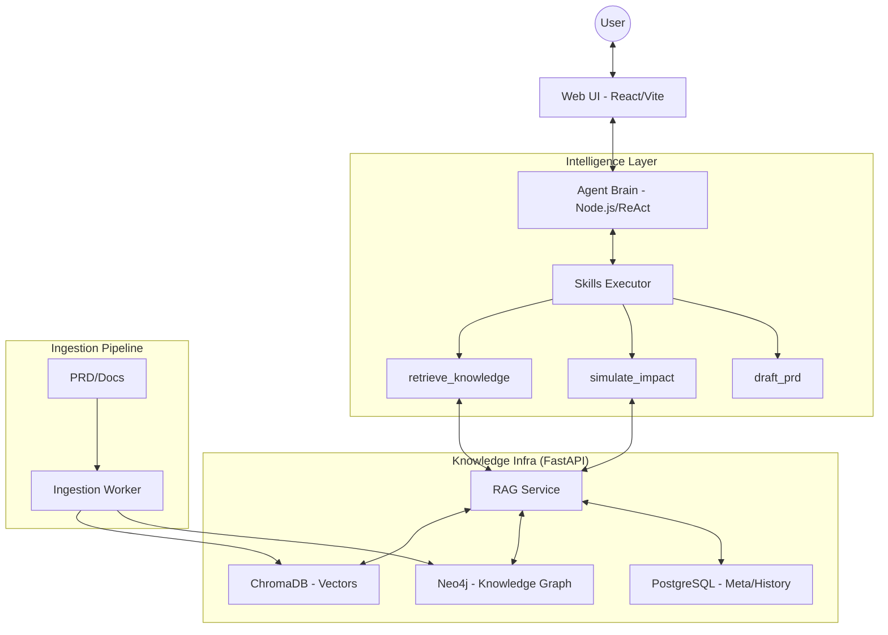

# Nexis (Next-Gen Intelligent System)

[English](#english) | [中文](#中文)

---

<a name="english"></a>

# Nexis (Next-Gen Intelligent System) - English

> **Nexis is an enterprise-grade knowledge lifecycle management system powered by Graph-Augmented Retrieval (GraphRAG), Agentic Workflows, and Architectural Impact Simulation.**

Nexis is more than just a RAG (Retrieval-Augmented Generation) tool; it’s a "Business Architect's Assistant." It extracts complex business logic from hundreds of PRD documents, builds a structured knowledge graph, and allows users to simulate the impact of new requirements in a "Virtual Sandbox."

---

## 🚀 Key Features

- **Graph-RAG Dual-Engine Retrieval**: Combines semantic matching (ChromaDB) with multi-hop logical association (Neo4j) to precisely recover business chains across documents.
- **Architectural Sandbox (Simulate Impact)**: Automatically analyzes the feasibility of new requirement proposals, predicts impacts on existing modules, and identifies potential logical conflicts (Broken Rules).
- **Automated PRD Drafting (Draft PRD)**: Generates standardized PRDs based on simulation results with one click, providing professional Markdown formatting.
- **Automated Taxonomy Consolidation**: Built-in Map-Reduce logic to automatically merge redundant taxonomy suggestions, keeping the knowledge base clean and structured.
- **Hybrid Model Strategy**: Deeply optimized for Alibaba Qwen `text-embedding-v3` for high-precision Chinese vectorization, supporting large-scale reasoning and "Thought" models.

---

## 🏗️ System Architecture



---

## 🛠️ Tech Stack

| Module | Tech Stack |
| :--- | :--- |
| **Frontend (Web UI)** | React 19, Vite, TailwindCSS, Shadcn UI, Lucide Icons |
| **Agent Brain** | Node.js, TypeScript, AI SDK / ReAct Pattern |
| **Backend API (RAG)** | Python 3.10+, FastAPI, SQLAlchemy |
| **Vector Database** | ChromaDB (with Dashscope `text-embedding-v3`) |
| **Graph Database** | Neo4j 5.x |
| **Persistence & Cache** | PostgreSQL 15, Redis 7.0 |

---

## 📦 Quick Start

### 1. Configure Environment
Create a `.env` file in the root directory and add your API keys:
```env
GEMINI_API_KEY=your_gemini_key
DASHSCOPE_API_KEY=your_qwen_key
NEO4J_PASSWORD=nexis_password
```

### 2. Launch with One Command
We provide a convenient script for full deployment:
```bash
./manage.sh start
```
This command automatically builds and starts all Docker containers (Postgres, Redis, Neo4j, Chroma, RAG API, Agent, Web UI).

### 3. Access the System
- **Web UI**: [http://localhost:5173](http://localhost:5173)
- **Admin Dashboard**: [http://localhost:5173/admin](http://localhost:5173/admin)
- **Graph Explorer**: [http://localhost:5173/graph](http://localhost:5173/graph)

---

## 📖 Core Skill Scenarios

### 1. Business Process Retrieval
Q: "What are the core processes for ticketing?"
> The assistant uses Neo4j to follow `NEXT_STEP` relationships, outlining the complete path from ticketing registration to receipt.

### 2. Requirement Simulation
Q: "If we support initiating acceptance and collection simultaneously after registration, can this be realized?"
> The assistant triggers the `simulate_impact` skill to tell you if the change breaks existing compliance rules.

### 3. Automated Drafting
Q: "Draft a PRD for that proposal."
> The assistant writes a professional Markdown PRD based on the identified impacts and logic changes.

---

<a name="中文"></a>

# Nexis (Next-Gen Intelligent System) - 中文

> **Nexis 是一个基于图增强检索 (GraphRAG)、多代理协作 (Agentic Workflow) 和架构仿真推演的企业级知识生命周期管理系统。**

Nexis 不仅仅是一个 RAG (检索增强生成) 工具，它是一个“业务架构师助手”。它能够从数以百计的 PRD 文档中提取复杂的业务逻辑，构建结构化的知识图谱，并允许用户在“仿真沙盒”中推演新需求的影响。

---

## 🚀 核心特性

- **Graph-RAG 双引擎检索**: 结合向量搜索 (ChromaDB) 的模糊语义匹配与知识图谱 (Neo4j) 的多跳逻辑关联，精准找回跨文档的业务链路。
- **架构沙盘推演 (Simulate Impact)**: 自动分析新需求提案的可行性，预判对现有模块的冲击，识别潜在的逻辑冲突（Broken Rules）。
- **自动化 PRD 起草 (Draft PRD)**: 基于架构推演结果，一键生成标准化的中文 PRD 文档，提供 Markdown 级富文本排版。
- **自动化分类治理 (Taxonomy Consolidation)**: 内置 Map-Reduce 逻辑，自动合并冗余的知识分类建议，保持知识库长久整洁。
- **混合模型策略**: 深度适配阿里巴巴通义千问 (Qwen) `text-embedding-v3` 进行高精度中文向量化，并支持大规模推理与思考模型。

---

## 🏗️ 系统架构

（架构图见上文英文版）

---

## 🛠️ 技术栈

| 模块 | 技术栈 |
| :--- | :--- |
| **前端 (Web UI)** | React 19, Vite, TailwindCSS, Shadcn UI, Lucide Icons |
| **代理大脑 (Agent)** | Node.js, TypeScript, AI SDK / ReAct Pattern |
| **后端 API (RAG)** | Python 3.10+, FastAPI, SQLAlchemy |
| **向量数据库** | ChromaDB (搭配 Dashscope `text-embedding-v3`) |
| **图数据库** | Neo4j 5.x |
| **持久化与缓存** | PostgreSQL 15, Redis 7.0 |

---

## 📦 快速启动

### 1. 配置环境
在根目录下创建 `.env` 文件，填入必要的 API 密钥：
```env
GEMINI_API_KEY=your_gemini_key
DASHSCOPE_API_KEY=your_qwen_key
NEO4J_PASSWORD=nexis_password
```

### 2. 一键启动
我们提供了便捷的脚本进行全量部署：
```bash
./manage.sh start
```
该命令会自动构建并启动所有 Docker 容器（Postgres, Redis, Neo4j, Chroma, RAG API, Agent, Web UI）。

### 3. 进入系统
- **Web 访问**: [http://localhost:5173](http://localhost:5173)
- **管理后台**: [http://localhost:5173/admin](http://localhost:5173/admin)
- **图谱预览**: [http://localhost:5173/graph](http://localhost:5173/graph)

---

## 📖 核心技能使用场景

### 1. 业务流程检索
问：“出票的核心流程有哪些？”
> 助手将通过 Neo4j 顺着 `NEXT_STEP` 关系，为您梳理出从出票登记到票据签收的完整路径。

### 2. 需求仿真推演
问：“如果支持出票登记成功后同时发起提示承兑和提示收票，可以实现吗？”
> 助手会触发 `simulate_impact` 技能，通过沙盘模拟告诉你该变更是否会破坏现有的承兑合规性。

### 3. 自动化写稿
问：“请帮我起草刚才那个提案的 PRD。”
> 助手会根据推演出的受影响模块和变更逻辑，自动编写一份精美的中文 PRD Markdown 文档。

---

## ⚖️ 许可证

本项目基于 MIT 协议开源。
