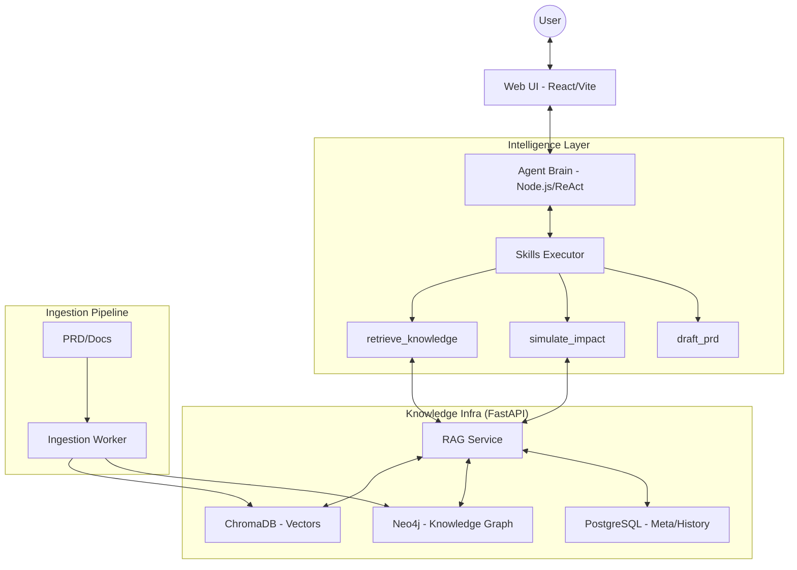

# Nexis (Next-Gen Intelligent System)

English | [中文](./README.zh-CN.md)

---

> **Nexis is an enterprise-grade knowledge lifecycle management system powered by Graph-Augmented Retrieval (GraphRAG), Agentic Workflows, and Architectural Impact Simulation.**

Nexis is more than just a RAG (Retrieval-Augmented Generation) tool; it’s a "Business Architect's Assistant." It extracts complex business logic from hundreds of PRD documents, builds a structured knowledge graph, and allows users to simulate the impact of new requirements in a "Virtual Sandbox."

---

## 🚀 Key Features

- **Graph-RAG Dual-Engine Retrieval**: Combines semantic matching (ChromaDB) with multi-hop logical association (Neo4j) to precisely recover business chains across documents.
- **Architectural Sandbox (Simulate Impact)**: Automatically analyzes the feasibility of new requirement proposals, predicts impacts on existing modules, and identifies potential logical conflicts (Broken Rules).
- **Automated PRD Drafting (Draft PRD)**: Generates standardized PRDs based on simulation results with one click, providing professional Markdown formatting.
- **Automated Taxonomy Consolidation**: Built-in Map-Reduce logic to automatically merge redundant taxonomy suggestions, keeping the knowledge base clean and structured.
- **Hybrid Model Strategy**: Deeply optimized for Alibaba Qwen `text-embedding-v3` for high-precision Chinese vectorization, supporting large-scale reasoning and "Thought" models.

---

## 🏗️ System Architecture



---

## 🛠️ Tech Stack

| Module | Tech Stack |
| :--- | :--- |
| **Frontend (Web UI)** | React 19, Vite, TailwindCSS, Shadcn UI, Lucide Icons |
| **Agent Brain** | Node.js, TypeScript, AI SDK / ReAct Pattern |
| **Backend API (RAG)** | Python 3.10+, FastAPI, SQLAlchemy |
| **Vector Database** | ChromaDB (with Dashscope `text-embedding-v3`) |
| **Graph Database** | Neo4j 5.x |
| **Persistence & Cache** | PostgreSQL 15, Redis 7.0 |

---

## 📦 Quick Start

### 1. Configure Environment
Create a `.env` file in the root directory and add your API keys:
```env
GEMINI_API_KEY=your_gemini_key
DASHSCOPE_API_KEY=your_qwen_key
NEO4J_PASSWORD=nexis_password
```

### 2. Launch with One Command
We provide a convenient script for full deployment:
```bash
./manage.sh start
```
This command automatically builds and starts all Docker containers (Postgres, Redis, Neo4j, Chroma, RAG API, Agent, Web UI).

### 3. Access the System
- **Web UI**: [http://localhost:5173](http://localhost:5173)
- **Admin Dashboard**: [http://localhost:5173/admin](http://localhost:5173/admin)
- **Graph Explorer**: [http://localhost:5173/graph](http://localhost:5173/graph)

---

## 📖 Core Skill Scenarios

### 1. Business Process Retrieval
Q: "What are the core processes for ticketing?"
> The assistant uses Neo4j to follow `NEXT_STEP` relationships, outlining the complete path from ticketing registration to receipt.

### 2. Requirement Simulation
Q: "If we support initiating acceptance and collection simultaneously after registration, can this be realized?"
> The assistant triggers the `simulate_impact` skill to tell you if the change breaks existing compliance rules.

### 3. Automated Drafting
Q: "Draft a PRD for that proposal."
> The assistant writes a professional Markdown PRD based on the identified impacts and logic changes.

---

## ⚖️ 许可证

本项目基于 MIT 协议开源。
