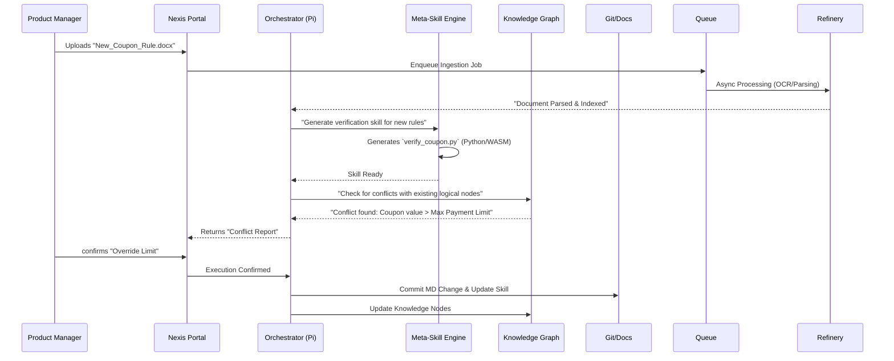

# Nexis 2026: Enterprise Intelligence Hub (Architecture V2.0)

> **Vision**: To evolve Nexis from a "Documentation Assistant" into an **Enterprise-Grade Intelligence Hub** that governs, synchronizes, and evolves business logic across hundreds of PRDs and systems.

---

## 1. Executive Summary

Nexis 2026 is not just a chatbot; it is a **Business Logic Operating System**. It sits between human intent (PRDs) and system implementation (Code/Config), ensuring that "What is written" matches "What is running".

By 2026, Nexis will handle:
*   **Scale**: 500+ Active PRDs, 10,000+ Business Rules.
*   **Complexity**: Cross-domain conflict detection (e.g., Marketing Coupon vs. Finance Risk Control).
*   **Autonomy**: Self-writing verification skills ("Meta-Skills") to adapt to new business lines without engineering intervention.

---

## 2. Core Architecture (The 4 Layers)

Nexis adopts a **Layered Micro-Kernel Architecture** to ensure extensibility and security.

### 2.1 Layer 1: Interoperability (The Senses)
*The interfaces through which Nexis perceives and interacts with the human world.*

*   **Web Portal**: A unified dashboard for Requirement Management, Knowledge Graph visualization, and audit logs.
*   **IM Sidecar**: Bots residence in Slack/Lark/DingTalk to intercept discussions.
    *   *Scenario*: PM says "Let's lower the limit to 100", Nexis bot interrupts: "Warning: This contradicts the logic defined in Finance PRD #102."
*   **IDE Plugin**: A VS Code/JetBrains extension that validates code against PRD logic in real-time (Linting for Logic).

### 2.2 Layer 1.5: Data Refinery (The Stomach)
*Dedicated asynchronous pipeline for heavy-lifting document processing.*

*   **Document ETL Service**:
    *   **Purpose**: Decouples heavy file parsing (PDF/Word/Images) from the main cognitive loop.
    *   **Tech Stack**: **`MarkItDown` (Microsoft)** (Primary for Office/PDF), `LlamaParse` (Complex OCR), `Redis` (Queue).
    *   **Flow**: User Upload -> Queue -> Worker Pool -> Markdown -> Knowledge Base.
    *   **Isolation**: Runs in separate heavy-compute containers to prevent OOM (Out of Memory) affecting the Agent.

### 2.2 Layer 2: Orchestration (The Pi Brain)
*The central cognitive engine driven by the Pi Architecture.*

*   **Task Planner**: Decomposes vague intent ("Check if this new feature is safe") into execution steps.
*   **Skill Engine (Polyglot Runtime)**:
    *   Executes verification logic.
    *   **Containerized Sandbox**: Runs skills in isolated Docker/WASM environments to ensure safety.
    *   **Polyglot Support**:
        *   **Python**: Data analysis, RAG, Graph reasoning (90% of skills).
        *   **Node.js**: Web interaction, frontend syncing.
        *   **Go/Rust**: High-performance log auditing.
*   **Consistency Guard (GraphRAG)**: The core arbiter of truth. Uses **Multi-hop Reasoning** (Vector + Graph) to find indirect conflicts.

### 2.3 Layer 3: Knowledge (The Memory)
*A Multi-Modal implementation of organizational memory.*

*   **Vector DB (Chroma/LanceDB)**: Semantic index of all PRDs for fuzzy retrieval ("Find rules about 'refunds'").
*   **Graph DB (Neo4j/Nebula)**: Deterministic dependency map.
    *   `(UserLevel) --[determines]--> (WithdrawLimit)`
    *   `(WithdrawLimit) --[impacts]--> (FinancialRiskModule)`
*   **FileSystem / Object Store**: Stores raw Markdown files and their **Versioned Snapshots**.

### 2.4 Layer 4: Integration (The Limbs)
*Connectors to the existing enterprise ecosystem.*

*   **Identity (LDAP/SSO)**: RBAC for PRD modification.
*   **DevOps (GitLab/GitHub)**: Commits PRD changes as code; triggers CI/CD pipelines when logic changes.
*   **Project Mgmt (Jira/Linear)**: Automatically converts "TODO" items in PRDs into Jira tickets.

### 2.5 Layer 5: Governance & Observability (The Conscience)
*Monitoring, Evaluation, and Feedback Loops.*

*   **Observability Dashboard (Grafana/LangSmith)**:
    *   **Metrics**: Conflict Detection Rate, False Positive Rate, Skill Execution Latency.
    *   **Alerting**: "Error Rate > 5% in Finance Module".
*   **Human-in-the-Loop (RLHF)**:
    *   **Feedback Mechanism**: When a PM overrides a Nexis warning ("Ignore this conflict"), the decision is logged.
    *   **Negative Sampling**: These overrides become "Negative Examples" in the Vector DB. Next time, Nexis checks: "Is this similar to a previously ignored warning?" If so, suppress the alert.

---

## 3. Strategic Differentiators


### 3.1 Knowledge Time-Travel (Versioning)
Business rules change over time. Nexis tracks the **Effective Time** of every rule.
*   *Query*: "What was the withdrawal limit for Level 2 users on Dec 2025?"
*   *Implementation*: Temporal Knowledge Graph + Git History.

### 3.2 Privacy-First Local Sandbox
Nexis follows a **"Local-First, Cloud-Augmented"** philosophy.
*   **Data Masking Skill**: Before sending any prompt to a massive LLM (Gemini/GPT-4), PII (Personally Identifiable Information) is scrubbed locally.
*   **Local Inference**: Small/Specialized models run locally for basic tasks (summarization, simple classification) to reduce latency and cost.

### 3.3 Meta-Skills (Self-Evolving Capability)
The ability for Nexis to write its own tools.
*   **Input**: A new PRD describing "Group Buying".
*   **Action**: Nexis generates a Python script `verify_group_buy.py` to check the logic constraints defined in the text.
*   **Safety**: The script runs in a **WASM Sandbox** with read-only access to the Knowledge Graph, preventing system damage.

### 3.4 Consistency Guard with GraphRAG
Traditional RAG retrieves similar text. GraphRAG retrieves **Logic Chains**.
*   *Vector*: Finds "Withdrawal Limit".
*   *Graph*: Traces `Limit` -> `Risk Model` -> `Compliance Report`.
*   *Outcome*: Nexis warns "Changing this limit requires updating the Compliance Report format."

---

## 4. Execution Flow (The Lifecycle)



---

## 5. Deployment Topology

```mermaid
graph TD
    User((User)) -->|HTTPS| Gateway[API Gateway / LB]
    
    subgraph "Application Layer"
        Portal[Web Portal & IDP]
        Pi[Pi Orchestrator]
    end
    
    subgraph "Compute Layer (Sandboxed)"
        PyRuntime[Python Runtime (Data/AI)]
        NodeRuntime[Node Runtime (Web)]
        WASM[WASM Runtime (High Perf)]
    end
    
    subgraph "Data Layer"
        Vector[(Vector DB)]
        Graph[(Graph DB)]
        FileSys[Git / File Storage]
    end
    
    Gateway --> Portal
    Portal --> Queue[(Redis Queue)]
    Queue --> Refinery[ETL Workers]
    Refinery --> Vector
    Refinery --> FileSys
    
    Portal --> Pi
    Pi --> PyRuntime
    Pi --> NodeRuntime
    Pi --> WASM
    
    PyRuntime --> Vector
    PyRuntime --> Graph
    WASM --> Graph
    
    Pi --> FileSys
```
